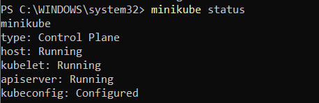

## Objective
Deploy a sample Nginx application in a local Kubernetes cluster using Minikube, verify its functionality, scale it, and capture all required screenshots for submission.

---

## 1. Prerequisites
- **Docker Desktop** installed and running.
- **Minikube** installed (`minikube version`).
- **kubectl** installed (`kubectl version --client`).
- Virtualization enabled in BIOS/UEFI.

---

## 2. Steps Performed

### Step 1 — Start Minikube Cluster
```bash
minikube start --driver=docker --cpus=2 --memory=4096
minikube status
````

**Screenshot:** 

---

### Step 2 — Create Deployment Manifest

`manifests/deployment.yaml`

```yaml
apiVersion: apps/v1
kind: Deployment
metadata:
  name: nginx-deployment
  labels:
    app: nginx
spec:
  replicas: 1
  selector:
    matchLabels:
      app: nginx
  template:
    metadata:
      labels:
        app: nginx
    spec:
      containers:
      - name: nginx
        image: nginx:alpine
        ports:
        - containerPort: 80
```

---

### Step 3 — Create Service Manifest

`manifests/service.yaml`

```yaml
apiVersion: v1
kind: Service
metadata:
  name: nginx-service
spec:
  selector:
    app: nginx
  ports:
    - protocol: TCP
      port: 80
      targetPort: 80
      nodePort: 30080
  type: NodePort
```

---

### Step 4 — Apply Manifests

```bash
kubectl apply -f manifests/deployment.yaml
kubectl apply -f manifests/service.yaml
kubectl get deployments
kubectl get pods -o wide
kubectl get svc
```

**Screenshots:**

* `screenshots/02_apply.png` — applying manifests
* `screenshots/03_get_pods.png` — pods running
* `screenshots/04_get_svc.png` — service details

---

### Step 5 — Access the Application

```bash
minikube service nginx-service --url
```

Open the displayed URL in a browser.
**Screenshot:** `screenshots/07_dashboard.png`

---

### Step 6 — Scale the Deployment

```bash
kubectl scale deployment/nginx-deployment --replicas=3
kubectl get pods -l app=nginx
```

---

### Step 7 — Describe and Logs

```bash
kubectl describe pod <pod-name>
kubectl logs <pod-name>
```

**Screenshots:**

* `screenshots/05_describe_pod.png` — pod details/events

---

### Step 8 — Exec Into Pod and Test

```bash
kubectl exec -it <pod-name> -- /bin/sh
curl -I localhost
exit
```

---

## 3. Folder Structure

```
task5-minikube/
├─ manifests/
│  ├─ deployment.yaml
│  └─ service.yaml
├─ screenshots/
│  ├─ 01_minikube_status.png
│  ├─ 02_apply.png
│  ├─ 03_get_pods.png
│  ├─ 04_get_svc.png
│  ├─ 05_describe_pod.png
│  ├─ 06_app_running.png
|  └─ 07_dashboard.png
└─ README.md
```

---

## 4. How to Reproduce

1. Clone this repository:

```bash
git clone https://github.com/MSAgarwal/t5-minikube.git
cd t5-minikube
```

2. Start Minikube:

```bash
minikube start --driver=docker --cpus=2 --memory=4096
```

3. Apply manifests:

```bash
kubectl apply -f manifests/
```

4. Access service:

```bash
minikube service nginx-service --url
```

5. Scale deployment:

```bash
kubectl scale deployment/nginx-deployment --replicas=3
```

---

## 5. Troubleshooting

* **Pods not starting**: `kubectl describe pod <pod>` for events.
* **Service unreachable**: verify labels in `service.yaml` match pod labels.
* **Minikube start fails**: ensure Docker Desktop is running and virtualization is enabled.
* **Port conflict**: change `nodePort` in `service.yaml` to an unused port in range 30000–32767.

---
